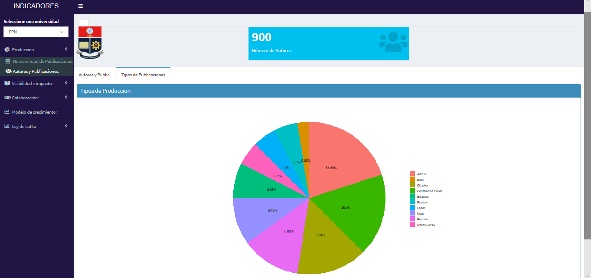

--- 
title: "MANUAL PARA LA APLICACIÓN DE INDICADORES DE PRODUCCIÓN CIENTÍFICA EN EL ECUADOR ASOCIADO A SCOPUS"
author: "Aplicación por: Jeysson Chuquin, Wagner Salazar"
date: '`r Sys.Date()`'
bibliography:
- book.bib
- packages.bib
description: This is a minimal example of using the bookdown package to write a book.
  The output format for this example is bookdown::gitbook.
documentclass: book
link-citations: yes
site: bookdown::bookdown_site
biblio-style: apalike
---

#Introducción

  El objetivo de este manual es conocer los índices de producción científica en el Ecuador asociado a Scopus, siendo la Producción Científica en Ecuador una de las actividades más representativas en el criterio de la evaluación institucional con un 9% de peso. La producción Científica es un factor importante para determinar la calidad de una IES (Institución de Educación Superior) y para determinar el crecimiento de un país. 
  
  El presente manual presenta como es el comportamiento de la Producción Científica dentro de las universidades del Ecuador , oteniendo un estado real de la investigación a nivel país a través de los conceptos asociados a la Bibliometría, rama de la Cienciometría que tiene como unidad de análisis el artículo científico [1]. 
 
  En correspondencia, en el primer apartado se hace referencia a los indicadores de  Producción dónde se refleja el número de publicaciones y los autores. En el segundo apartado se profundiza en la Visibilidad e impacto dónde muestra el número total de citas, citas por documento científico e índice H. En el tercer apartado muestra la Colaboración Naional e Internacional de las publicaciones de Ecuador entre países . En el cuarto apartado se tiene un modelo de crecimiento con el fin de predecir cuantó se va a publicar. Finalmente, en el último  apartado se presenta  la Ley de Lotka dónde muestra la Producción Personal. Para ello es importante conocer ciertos términos que nos facilitarán la comprensión de la aplicación.

##Elaborado por
Esta aplicación de indicadores de producción científica del Ecuador, fue diseñada por dos estudiantes de la carrera de Ingeniería Matemática de la Escuela Politécnica Nacional, que gracias a *Scopus* han obtenido la información necesaria para el desarrollo de esta apliación y basados en el Proyecto de titulación de la Ing. Jéssica Morocho

Autores:

- Jeysson Chuquín (jeysson.chuquin@epn.edu.ec)
- Wagner Salazar (wagner.salazar@epn.edu.ec)

Supervición:

- Miguel Flores PhD. (miguel.flores@epn.edu.ec)

Este manual de aplicación es elaborado por:

- Lizeth Moreno
- María Belén Rosero


###SCOPUS
Una base de datos bibliográficos de resumenes y citas de artículos de revistas científicas que también ofrece perfiles de autor y afiliaciones. (www.scopus.com)

#Conceptos Importantes  

##Leyes Bibliométricas

La Bibliometría es un campo de investigación que se encuentra en constante desarrollo , siendo los primeros modelos las Leyes Bibliométricas: Ley de Lotka, Ley de Bradford Ley de Garfield, Ley de Zipf, Ley de envejecimiento , Ley de visibilidad y el principio de la ventaja acumulativa .

##Ley de Lotka 

Es una ley Bibliométrica basada en una distribución de probabilidades discreta que nos permite describir la productividad de autores tal que:

Sean:

$A_{n}$ el número de autores desarrollando n artículos y $A_{1}$ el número de autores desarrollando 1 artículo.

Entonces: 
$$A_{n}=\frac{A_{1}}{n^{m}}$$
con $m\in R^{+}$

En este manual se utilizará la Ley de Lotka para :

•Verificar si la producción científica dentro de las IES ecuatorianas satisfacen la ley de Lotka.

•Ejemplarizar la clasificación de los autores según el Índice de Productividad Personal.

##Modelos de Crecimiento Exponencialde Price
Dentro de las formas de enunciar la "Ley del crecimiento exponencial de Price", se tiene las siguientes:

•“La Ciencia crece a interés compuesto, multiplicándose por una cantidad determinada
en períodos iguales de tiempo” [1].
• “La tasa de crecimiento es proporcional al tamaño de la población o magnitud total
adquirida” [1].
• “Cuanto más grande es la Ciencia, más deprisa crece” [1].


La curva de crecimiento de la producción científica, se representa por:
$$P(t)=P_{0}e^{at}$$
con $a\in R^{+}$ y $P(0)=P_{0}$ como condición inicial.

En este manual el modelo de crecimiento se utilizará para :

•Verificar si la producción científica de las IES ecuatorianas satisfacen el modelo de
crecimiento de Price.

• Establecer proyecciones al año 2020 utilizando el modelo ajustado.

#Indicadores Bibliométricos

El uso de los métodos de la Bibliometría es una opción para el evaluo de programas de investigación , determinar el cumplimiento de objetivos y más .

Los indicadores bibliométricos depende de que las publicaciones científicas sean representativas de los resultados de la investigación para ser validados, lo que implica que existan mecanismos que garanticen la estabilidad de sus contenidos y la calidad de los mismos. 

Así, los indicadores bibliométricos conforman un herramienta que permite medir la producción de la investigación científica con el objetivo de que la documentación publicada sea transferible de manera oral o escrita para un mejor desarrollo en el campo intelectual. 

Se tienen tres tipos de indicadores: Producción, Visibilidad e impacto y de colaboración.

##Teoría Bibliométrica 

###Índice H
El índice-H es un indicador el cual nos permite evaluar de manera simultáea la productividad y el impacto tal que 

$$\forall x \in N_{0}^{n}, H_\text{index}(x)=max\{i=1,...,n: x_{n+1-i}>i\}$$
dónde $x_{i}$ corresponde al i-ésimo estadístico de orden, es decir, es el i-ésimo valor más pequeño de $x$.

#Uso de la Aplicación

##Pantalla de Inicio
Al acceder a la aplicación nos encontramos con la siguiente pantalla que por defecto se observa información de la EPN. A continuación se procederá con una guía rápida de la aplicación usando la infromación de esta IES.

```{r, echo=FALSE, out.width='90%', fig.align='center', fig.cap='Pantalla de inicio'}

```

##Selección de Universidades
La funcionalidad de esta aplicación es muy amigable con el usuario puesto que se puede escoger entre las diferentes universidades que han aportado a la producción científica del Ecuador.

```{r, echo=FALSE, out.width='90%', fig.align='center', fig.cap='Selección de Universidades'}
knitr::include_graphics("imagenes/pantalla_2.png")
```

##Producción
###Número total de Publicaciones
La primera opción de la barra que se desplega de universidades es la EPN, donde se muestra el sello de la Escuela, el número de autores y un gráfico del crecimiento de aportaciones científicas por años lo que corresponde a la opción Producción del menú.

```{r, echo=FALSE, out.width='90%', fig.align='center', fig.cap='Gráfico de creciemiento por años'}
knitr::include_graphics("imagenes/pantalla_3.png")
```

Deslizando hacia abajo encontraremos el número de publicaciones por año.

```{r, echo=FALSE, out.width='90%', fig.align='center', fig.cap='Número de publicaciones por años'}
knitr::include_graphics("imagenes/pantalla_4.png")
```

Además se puede observar de forma ascendente y descenden el número de publicaciones por año. Por ejemplo en la EPN, el año con más aportaciones es el año 2018 con 604 producciones.

###Autores y Publicaciones
En esta subsección se puede visualizar el nombre de todos los autores con su respectivo *ID Autor* según Scopus, el nro. de documentos que han aportado a la producción científica y el nro de Citas en diferentes artículos publicados en Scopus.

```{r, echo=FALSE, out.width='90%', fig.align='center', fig.cap='Autores, ID, Nro. de documentos y citas'}
knitr::include_graphics("imagenes/pantalla_5.png")
```

###Tipos de publicación
Se puede apreciar en esta subsección un gráfico tipo pastel indicando el tipo de publicación, en este caso para la EPN el 51.08% de producción es de tipo artículo.

```{r, echo=FALSE, out.width='90%', fig.align='center', fig.cap='Tipo de publicación'}

```

###Áreas de publicaciones
En esta subsección se visualiza todas las áreas científicas que se han publicado, con las siguientes siglas se podrá comprender con facilidad cuales son estas áreas:

- AGRI: agricultura y ciencias biologicas
- ARTS: artes y huanidades
- BIOC: bioquimica, genetica y biologia molecular
- BUSI: negocios, gestion y contabilidad
- CENG: Ingenieria quimica
- CHEM: Quimica
- COMP: Computer Science
- DECI: Ciencias de decision
- DENT: Dentistry
- EART: Tierra y ciencias planetarias
- ECON: Economia
- ENER: Energia
- ENGI: Ingenieria
- ENVI: Ciencias del medio ambiente
- HEAL: Salud
- IMMU: Inmunologia y microbiologia
- MATE: Ciancias de materiales
- MATH: Matematica
- MEDI: Medicina
- NEUR: Neurociencia
- NURS: Enfermeria
- PHAR: Farmacologia, toxicologia y farmacos
- PHYS: Fisica
- PSYC: Psicologia
- SOCI: Ciencias Sociales
- VETE: Veterinaria
- MULT: Multidiciplinario

```{r, echo=FALSE, out.width='90%', fig.align='center', fig.cap='áreas de publicación'}
knitr::include_graphics("imagenes/pantalla_98.png")
```

##Visibilidad e impacto
###Número total de citas
Los índices de citas permiten conocer las 'citas' que han recibido las diferentes publicaciones en diferentes documentos asociados a Scopus. Por ejemplo, En el año 1968 se han publicado 3 artículos, con un total de 108 citaciones en otros documentos.  

```{r, echo=FALSE, out.width='90%', fig.align='center', fig.cap='Citas por años'}
knitr::include_graphics("imagenes/pantalla_7.png")
```

A continuación, se muestra un gráfico de producción vs citas, a través de los años.

```{r, echo=FALSE, out.width='90%', fig.align='center', fig.cap='Producción vs Citas'}

```

###Citas por documento científico
En la siguiente lista que se presenta se puede observar el nombre de los documentos con su autor, ID de author y obra, y finalmente el número de citaciones de la obra en diferentes documentos asociados a Scopus. Por ejemplo, para la EPN el autor Ruales J. con su artículo 'Nutritional quality of the protein in quinoa (Chenopodium quinoa, Willd) seeds' tiene un total de 96 citas.

```{r, echo=FALSE, out.width='90%', fig.align='center', fig.cap='Citas por documento'}
knitr::include_graphics("imagenes/pantalla_9.png")
```

###Índice H
El índice H es un índice que cuantifica tanto la productividad científica real como el impacto científico aparente de un aportante. Del ejemplo de la subsección anterior el autor Ruales J. con más citaciones tiene un índice H de 25 que lo coloca en los más altos según el cálculo del índice H.

```{r, echo=FALSE, out.width='90%', fig.align='center', fig.cap='Tabla de índice H'}
knitr::include_graphics("imagenes/pantalla_91.png")
```

##Colaboraciones
Esta sección muestra los países que han colaborado con la EPN y así con las distintass universidades del país. Por ejemplo, Francia ha colaborado un 8.95% con la EPN.

```{r, echo=FALSE, out.width='90%', fig.align='center', fig.cap='Colaboraciones'}
knitr::include_graphics("imagenes/pantalla_92.png")
```

Deslizamos hacia abajo y encontraremos un gráfico tipo pastel que muestra las proporciones de los países que han colaborado con la EPN en los diferentes documentos publicados. Además se visualiza otro gráfico tipo pastel con los porcentajes de colaboración nacional e internacional.

```{r, echo=FALSE, out.width='90%', fig.align='center', fig.cap='Colaboraciones'}

```

##Modelo de crecimiento
Al seleccionar esta opción se despliega un gráfico que se obtiene a partir del modelo de crecimiento de Price, indica una función exponencial que crece a través de los años además puede el modelo puede estimar el número de publicaciones que se debe tener en los siguientes años. 

```{r, echo=FALSE, out.width='90%', fig.align='center', fig.cap='Colaboraciones'}

```

Se debe tomar en cuenta que para universidades con baja producción científica el modelo de Price no es adecuado por lo que se realiza un modelo de Regresión para poder predecir un número total de publiaciones en los siguientes años.

A continuación se visualiza una tabla más específica de los datos de producción, Por ejemplo para el año 2024 se estima un total de 11219 aportaciones científicas a Scopus. Gracias a que este modelo relaciona la cantidad de producción científica y el aumento del número de autores.

```{r, echo=FALSE, out.width='90%', fig.align='center', fig.cap='Colaboraciones'}

```
 
##Ley de Lodka
Esta ley nos da un índice de producción personal, además de clasificar a los autores en diferentes tipos de producctores, Por Ejemplo Ayala E. tiene un total de 99 publicaciones por ende su indice de produccion es de 2 lo que lo coloca como un Gran Producctor.

```{r, echo=FALSE, out.width='90%', fig.align='center', fig.cap='Colaboraciones'}
knitr::include_graphics("imagenes/pantalla_96.png")
```

Y por último se muestra un gráfico tipo pastel que nos permite visualizar con facilidad las proporciones de tipos de productores de cada institución.

```{r, echo=FALSE, out.width='90%', fig.align='center', fig.cap='Colaboraciones'}

```

#Conclusión
El aplicativo nos muestra a partir de teoría Bibliométrica una visión del estado actual de la producción científica y por otro lado con la teoría de los modelos de Lotka y Price se muestra una visión del estado futuro de la producción científica.

#Bibliografía
[1] ROMANI F., HUAMANI C., GONZALES-ALCAIDE G., (2011), Estudios Bibliométricos
como línea de investigación en las ciencias biomédicas: una aproximación para el pregrado,
Lima,Perú.

[2] RUIZ BAÑOS R., El crecimiento de la Ciencia., Universidad de Granada: Departamento
de Biblioteconomía y Documentación.
```{r include=FALSE}
# automatically create a bib database for R packages
knitr::write_bib(c(
  .packages(), 'bookdown', 'knitr', 'rmarkdown'
), 'packages.bib')
```

